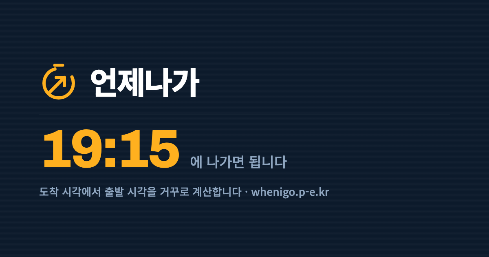

<p align="center">
  <a href="https://whenigo.p-e.kr">
    
  </a>
</p>

<p align="center">
  <a href="https://whenigo.p-e.kr"></a>
  <a href="https://github.com/sponsors/limchanggeon"></a>
  
  
  <a href="LICENSE.md"></a>
</p>

# 언제나가

"11시까지 부산" 처럼 **목적지와 도착 시각**만 말하면, 열차·시외버스 시각표와
환승·도보 시간을 뒤에서부터 짚어 **몇 시에 집을 나서야 하는지** 알려줍니다.

설계 배경은 [docs/PLATFORM.md](docs/PLATFORM.md)와 `docs/*.docx` 참조.

## 실행

```bash
pnpm install
cp .env.example .env    # 값을 채운 뒤

pnpm dev:all   # 웹(5173) + API(8787) 동시 실행 ← 보통 이걸 쓰면 됩니다
# 따로 띄우려면
pnpm dev       # 웹만  http://localhost:5173
pnpm server    # API만 http://localhost:8787

pnpm test      # 엔진 단위 테스트
pnpm typecheck # 클라이언트 + 서버 타입체크
pnpm build     # 프로덕션 번들
```

`/api` 요청은 vite 가 8787 로 프록시합니다. API 서버가 안 떠 있어도
앱은 동작하며, 로그인만 "서버에 연결하지 못했습니다"로 표시됩니다.

## 구조

```
src/
  engine/     ← 역산 엔진. React·DOM 모름. 앱(RN)에서도 그대로 재사용.
    types.ts     타입 계약 (LegSpec/Leg/Trip/Warning)
    time.ts      Date 유틸
    buffer.ts    수단별 여유 정책 (상수 테이블)
    schedule.ts  solveBackward / solveForward — 핵심 로직
  adapters/   ← 데이터 소스. 현재 카카오·TAGO 서버 응답을 사용한다.
    types.ts     RouteAdapter 계약, Failure(실패는 값이지 예외가 아니다)
    registry.ts  실제 어댑터 등록 + 라우팅. 목업은 제거됨
    live/        국내 경로 응답을 엔진 구간으로 변환
  parse/      ← 발화 파싱. 지금은 정규식, 나중에 Qwen3 0.6B로 교체(계약 동일).
  i18n/       ← 언어별 문구 사전. 결과 설명은 템플릿이지 LLM 생성이 아니다.
  ui/         ← React 컴포넌트. 플랫폼 종속 코드는 전부 여기.
```

## 실제 교통 데이터 (카카오 + TAGO)

현재 국내 경로는 **카카오 시내 경로와 국토교통부 TAGO 시각표**를 조합합니다.
예전 ODsay 어댑터는 현재 경로에서 사용하지 않습니다. 필요한 설정은
`.env.example`의 `KAKAO_REST_API_KEY`, `TAGO_SERVICE_KEY`를 참고하세요.
서버 키는 브라우저에 보내지 않습니다.

```
브라우저 → POST /api/route → 카카오 지오코딩 → 카카오 시내 경로 + TAGO 시외 조합
                        → 구간 배열 → 클라이언트 역산·순방향 계산
```

- 40km 미만은 카카오 시내 경로, 40km 이상은 카카오와 시외 조합을 병렬로 조회합니다.
- 시외 경로는 역·터미널·공항까지의 접근, 열차·고속버스·시외버스·항공,
  도착 후 목적지까지의 구간을 연결합니다. 양 끝을 연결하지 못한 후보는 제외합니다.
- TAGO 운행 시각이 있으면 엔진의 이산 구간으로 변환해 실제 시각표를 역산합니다.
  지하철 시각표도 연동하며, 시내버스 실시간 도착 예정은 아직 미구현입니다.
- 시각표가 없는 구간은 소요시간·배차 추정으로 표시합니다. 좌석 가용성은 제공하지 않습니다.
- 데이터가 없으면 `<DataGap>`으로 안내합니다. 목업 경로로 대체하지 않습니다.
- TAGO는 서비스별 신청이 필요합니다. 터미널 좌표 검증과 데이터 누락 대응은
  [HANDOVER.md](HANDOVER.md)에 정리돼 있습니다.

## 목업을 없앤 이유

초기에는 UI 를 먼저 만들려고 목업 어댑터를 뒀습니다. 실제 어댑터가 붙은 뒤로는
지우는 게 맞다고 판단해 제거했습니다.

목업이 남아 있으면 실제 데이터가 없을 때 **그럴듯한 가짜**가 대신 나옵니다.
그 가짜는 자기가 아는 범위를 벗어나면 조용히 헛소리를 합니다 —
대전에서 출발해도 "동네역(서울)까지 도보 6분" 같은 여정을 만들어냅니다.
그때마다 목업의 한계를 막는 코드가 하나씩 늘어나고, 화면은 여전히 그럴듯합니다.

데이터가 없으면 없다고 말하는 편이 낫습니다. 지금은 `<DataGap>` 이 떠서
무엇이 없어서 안 되는지를 그대로 보여줍니다.


## 외부 서비스 키 (지도 · 로그인)

`.env.example` 를 `.env` 로 복사하고 값을 채운 뒤 서버를 재시작하세요.
키가 없어도 앱은 정상 동작하며, 화면에 무엇이 빠졌는지 표시됩니다.

| 항목 | 환경변수 | 발급처 |
|---|---|---|
| 카카오 지도 + 카카오 로그인 | `VITE_KAKAO_JS_KEY` | [Kakao Developers](https://developers.kakao.com/console/app) — JavaScript 키 |
| 구글 지도 (해외 구간) | `VITE_GOOGLE_MAPS_KEY` | [Google Maps Platform](https://console.cloud.google.com/google/maps-apis) |
| 구글 로그인 | `VITE_GOOGLE_CLIENT_ID` | [Google Cloud Credentials](https://console.cloud.google.com/apis/credentials) — OAuth 웹 클라이언트 |

### 콘솔에 등록할 주소

포트는 `vite.config.ts` 에 고정돼 있습니다 — dev `5173`, preview `4173`.

**카카오** ([developers.kakao.com](https://developers.kakao.com/console/app) > 내 애플리케이션)

| 위치 | 넣을 값 |
|---|---|
| 앱 설정 > 플랫폼 > Web > 사이트 도메인 | `http://localhost:5173` 과 `http://localhost:4173` (경로 없이 오리진만) |
| 제품 설정 > 카카오 로그인 > 활성화 | ON |
| 제품 설정 > 카카오 로그인 > Redirect URI | `http://localhost:5173/auth/kakao/callback`<br>`http://localhost:4173/auth/kakao/callback` |
| 제품 설정 > 카카오 로그인 > 동의항목 | 필요한 항목만 켜기 (안 켜도 로그인은 됨) |
| 제품 설정 > **카카오맵** > 활성화 설정 | **ON** (지도를 쓰려면 반드시 켜야 함) |

> **KOE205 (잘못된 요청)** 이 뜬다면 콘솔에 켜지 않은 동의항목을 요청한 경우입니다.
> 이 프로젝트는 `scope` 를 보내지 않아 앱 설정을 그대로 따르므로 기본적으로 발생하지 않습니다.
> 이메일 등 추가 동의가 필요하면 콘솔에서 항목을 켠 뒤 `VITE_KAKAO_SCOPE` 에 넣으세요.

> 카카오맵 활성화를 안 켜면 SDK 요청이 403 으로 막히고 브라우저에는
> `ERR_BLOCKED_BY_ORB` 로만 보여 원인을 알기 어렵습니다.
> 응답 본문에는 `disabled OPEN_MAP_AND_LOCAL service` 가 들어 있습니다.
> (2024-12-01 부터 신규 앱은 기본 비활성 상태입니다.)

**구글** ([Cloud Console](https://console.cloud.google.com/apis/credentials) > OAuth 클라이언트 ID > 웹 애플리케이션)

| 위치 | 넣을 값 |
|---|---|
| 승인된 JavaScript 원본 | `http://localhost:5173`, `http://localhost:4173` |
| 승인된 리디렉션 URI | **불필요** — GIS 는 리다이렉트 없이 동작합니다 |

배포 후에는 위 `http://localhost:PORT` 자리에 실제 도메인(`https://...`)을 같은 형태로 추가하면 됩니다.
카카오 Redirect URI 는 `VITE_KAKAO_REDIRECT_URI` 를 비워두면 접속한 오리진에서 자동으로 만들어지므로,
콘솔에 도메인별로 등록만 해두면 코드는 건드릴 필요가 없습니다.

### 로그인 페이지

`/login` 에 별도 페이지가 있습니다 (`src/ui/pages/LoginPage.tsx`).

- **카카오**: 공식 디자인 가이드 규격으로 구현 — 배경 `#FEE500`, 텍스트 `#000000` 85% 투명도,
  모서리 반경 12px, 문구 "카카오 로그인", 심볼 필수.
  ⚠ 말풍선 심볼은 규격에 맞춰 그린 SVG입니다. 가이드가 심볼의 형태·비율 변경을 금지하므로
  **배포 전 카카오가 제공하는 공식 PNG 에셋으로 교체**하세요
  (`src/ui/components/KakaoLoginButton.tsx` 의 `<svg>` 부분만 바꾸면 됩니다).
- **구글**: Google Identity Services 의 `renderButton` 으로 구글이 직접 버튼을 그립니다 —
  브랜딩 규격이 자동으로 지켜집니다. 키가 없으면 대체 버튼이 표시됩니다.

> 참고: 구글의 구버전 "Google 로그인" 라이브러리(`gapi.auth2`, `signin2.render`) 문서는
> 상단에 **지원 중단** 경고가 붙어 있습니다. 이 프로젝트는 현행 방식인
> Google Identity Services 를 씁니다.

### 데이터베이스

`node:sqlite`(Node 내장)를 씁니다 — 의존성도 네이티브 빌드도 없습니다.
DB 파일은 `data/app.db` 이고 커밋되지 않습니다. 서버가 뜰 때 마이그레이션이
자동으로 돕니다(`server/db/migrate.ts`).

| 테이블 | 용도 |
|---|---|
| `users` | 계정. 소셜로만 가입하면 `password_hash` 가 비어 있습니다 |
| `identities` | 소셜 계정 연결. 같은 이메일이면 한 사용자에 여러 제공자가 붙습니다 |
| `sessions` | 세션. 예전에는 메모리라 재시작할 때마다 전원 로그아웃됐습니다 |
| `places` | 저장된 장소. "집" 같은 말을 좌표로 풀어줄 자리입니다 |

인스턴스를 여러 대 띄우게 되면 Postgres 로 옮겨야 합니다. 그때 바꿀 곳이
`server/db/` 와 쿼리들뿐이도록 표준에 가까운 SQL 로 썼습니다.

### 자체 로그인

이메일·비밀번호 가입/로그인을 지원합니다(`/api/auth/register`, `/api/auth/login`).

- 비밀번호는 `node:crypto` 의 **scrypt** 로 해싱합니다. 메모리를 많이 쓰도록
  설계돼 있어 GPU 대량 대입에 강합니다. 저장 형식에 알고리즘 접두사를 붙여
  나중에 바꿀 때 점진적으로 옮길 수 있습니다.
- 로그인 실패 시 **이메일 없음과 비밀번호 틀림을 구분하지 않습니다** —
  구분하면 어떤 이메일이 가입돼 있는지 알아낼 수 있습니다.
- 이메일은 대소문자를 구분하지 않습니다.
- 가입 시 인증 메일을 보내며, 24시간 유효한 일회용 링크를 누르면 가입이 완료됩니다. 인증 전에는 로그인할 수 없습니다.
- 기존 수동 승인 계정은 계속 이용할 수 있습니다. 인증 메일 재발송과 발송 실패 안내를 제공합니다.
- 세션 쿠키는 `httpOnly` + HMAC 서명입니다.

### 마이페이지 (`/me`)

로그인하면 헤더의 이름을 눌러 들어갑니다.

- **프로필** — 이메일·가입일 확인, 이름 변경
- **저장된 장소** — 집·회사 등록. 현재 위치로 채우거나 주소를 입력하면
  서버가 좌표로 바꿔 저장합니다.
- **연결된 로그인** — 이 계정에 붙은 소셜 제공자
- **비밀번호** — 변경. 소셜로만 가입한 계정은 현재 비밀번호를 묻지 않고
  새로 설정하게 합니다(세션으로 이미 본인 확인이 된 상태입니다).
- **계정 삭제** — 세션·장소·소셜 연결이 외래키 CASCADE 로 함께 지워집니다

#### 저장된 장소가 "집" 문제를 푼다

`집` `현재 위치` 같은 말은 장소 검색에 넘기면 엉뚱한 가게가 잡히므로
서버가 거절합니다. 대신 마이페이지에 저장해두면 검색창 출발지 옆에
칩으로 뜨고, 누르면 **이름과 좌표가 함께** 들어옵니다 — 검색할 일이 없어집니다.

### 해외 경로

나라를 보고 어댑터를 고릅니다. **서버가 정합니다** — 지오코딩 결과의 나라 코드를
쓰므로 클라이언트가 글자를 보고 추측하지 않습니다.

| 지역 | 제공자 | 상태 |
|---|---|---|
| 국내(KR) | 카카오 + TAGO | 동작 |
| 일본(JP) | — | **불가**, 아래 참조 |
| 그 외 | 구글 Directions | 동작 (런던·뉴욕 확인) |

#### 구글은 일본 대중교통을 제공하지 않습니다

실측으로 확인했습니다.

| 방식 | 도쿄 | 오사카 | 런던 | 뉴욕 |
|---|---|---|---|---|
| Directions API (웹서비스) | ZERO_RESULTS | ZERO_RESULTS | OK | OK |
| Routes API (신형) | 0개 | — | — | — |
| Maps JS SDK `DirectionsService` | ZERO_RESULTS | ZERO_RESULTS | OK | — |

구글 지도 **앱**에는 일본 대중교통이 있지만 현지 사업자와의 별도 계약이라
Maps Platform 으로는 열리지 않습니다. 그래서 일본은 "찾지 못했다" 가 아니라
"이 방법으로는 안 된다" 로 답합니다.

#### 일본을 하려면 무엇이 필요한가

이 앱의 알맹이는 **시각표 기반 역산**이라, 시각표 없는 자료로는 반쪽입니다.

| 자료 | 주는 것 | 없는 것 |
|---|---|---|
| [국토수치정보 N02](https://nlftp.mlit.go.jp/ksj/gml/datalist/KsjTmplt-N02-2023.html) | 노선·역 좌표, 사업자 (전국, CC BY 4.0) | **시각표·배차·환승·요금** |
| [ODPT](https://www.odpt.org/) | 시각표(GTFS), 실시간 위치 (수도권 중심, 등록 필요) | **경로 탐색 기능** |
| NAVITIME · 駅すぱあと · Jorudan | 경로 탐색까지 완성 | 유료 |

정리하면 무료 자료로는 **경로 탐색 엔진을 직접 만들어야** 합니다
(ODPT GTFS + OpenTripPlanner 자체 호스팅 등). 국내에서 카카오·TAGO 조합으로 처리하는 일을
일본에서는 우리가 해야 한다는 뜻입니다.

한국어·일본어·영어 UI 를 지원하지만 **데이터는 국내 전용**입니다 — 설계 문서의 "언어와 지역은
다른 축" 에서 언어 축만 구현된 상태입니다.

일본 지명을 넣으면 "찾지 못했습니다" 로만 답하던 것을 고쳤습니다.
그 문구는 오타처럼 들려서 사용자가 계속 다시 입력하게 됩니다.

- 가나가 들어간 지명은 `region-unsupported` 로 구분해 "준비 중" 이라고 알립니다
- 한자만 있는 지명(`新宿駅`)은 가려낼 수 없으므로, 검색 실패 문구 자체에
  "국내 장소만 검색할 수 있습니다" 를 담았습니다
- 사용자에게 보이는 문장은 **클라이언트가 화면 언어로** 만듭니다.
  서버 문구는 한국어라 그대로 띄우면 일본어 화면에 한국어가 섞입니다.
  서버의 `detail` 은 손쓸 거리가 있는 기술 오류(network/upstream)에만 보여줍니다.

### 알람 — 플랫폼마다 답이 다릅니다

| 플랫폼 | 시계 앱 알람 | 방법 |
|---|---|---|
| 웹 브라우저 | **불가** | 시스템 알람을 만드는 API 자체가 없습니다 |
| Android(네이티브) | 가능 | `AlarmClock.ACTION_SET_ALARM` 인텐트. 시계 앱 확인 화면을 엽니다 |
| iOS 26+(네이티브) | 가능 | **AlarmKit** — 무음·집중 모드를 뚫고 울리며 잠금화면·다이나믹 아일랜드·애플워치에 표시 |

iOS 는 오랫동안 막혀 있었지만 AlarmKit(2025 WWDC)으로 열렸습니다.
그래서 앱으로 가면 "웹푸시는 iOS 제약 때문에 후순위" 라는 초기 판단이 뒤집힙니다.

`src/alarm/` 에 provider 로 갈라 뒀습니다. 구글 캘린더와 Android 시계 알람은
구현돼 있고, iOS AlarmKit provider 는 아직 미구현입니다. Android 시계 알람은
날짜 없이 시·분만 넘기므로 먼 날짜의 일정은 캘린더를 사용해야 합니다.

Android 앱은 Capacitor 기반 `0.1.0-alpha`입니다. 하단 탭·설정 화면과
카카오 로그인 복귀를 구현했고, 웹 푸터에서 알파 APK 다운로드 링크를 제공합니다.
`pnpm app:apk`로 디버그 APK를 빌드합니다. 릴리스 서명 설정은
`android/app/build.gradle`을 참고하며, 키와 비밀번호는 저장소 밖에서 관리합니다.

### 구글 캘린더 연동

결과 화면의 **🔔 캘린더에 추가** 를 누르면 출발 시각에 일정이 생기고
15분·5분 전 알림이 걸립니다. 여정 전체가 일정 본문에 들어가므로
**캘린더가 곧 여정 저장소**가 됩니다.

로그인(ID 토큰)과는 **다른 권한**입니다. 캘린더에 쓰려면 OAuth 동의가 따로 필요합니다.

필요한 설정:

| 항목 | 값 |
|---|---|
| `.env` `GOOGLE_CLIENT_SECRET` | Cloud Console > OAuth 클라이언트 ID > 클라이언트 보안 비밀번호 |
| 구글 콘솔 **승인된 리디렉션 URI** | `http://localhost:4173/api/calendar/callback`<br>`http://localhost:5173/api/calendar/callback` |

> 경로가 `/api` 로 시작해야 합니다 — vite 는 `/api` 만 서버로 프록시하므로
> 다른 경로로 두면 SPA 가 받아버려 서버가 인가 코드를 보지 못합니다.

> 앞서 "리디렉션 URI 는 불필요" 라고 적었던 것은 **로그인**에만 해당합니다.
> 캘린더 권한은 OAuth 인가 코드 흐름이라 리디렉션 URI 가 필요합니다.

`access_type=offline` + `prompt=consent` 로 요청해 refresh token 을 받습니다 —
없으면 한 시간 뒤 만료되고 매번 다시 동의를 받아야 합니다.
`state` 를 세션에 묶어 CSRF 도 막습니다.

#### 테스트 모드의 제약

구글 OAuth 앱의 게시 상태가 **테스트**면 두 가지 제한이 있습니다.

| | 테스트 | 프로덕션 |
|---|---|---|
| 사용할 수 있는 사람 | **등록한 테스터만** (최대 100명) | 누구나 |
| refresh token | **7일 후 만료** | 무기한 |

테스터 추가: Cloud Console > **Google 인증 플랫폼 > 대상 > 테스트 사용자 > 사용자 추가**

7일마다 만료되는 것은 개발 중에는 정상 동작입니다. 그래서 갱신이 실패하면
저장된 토큰을 지워 마이페이지가 계속 "연결됨" 이라고 말하지 않게 하고,
화면이 다시 연결 버튼을 내도록 했습니다.

프로덕션으로 올리려면 `calendar.events` 가 민감한 범위라 **구글 심사**가 필요합니다.

### 서버 (server/)

카카오 로그인은 정석 흐름대로 **인가 코드 → 서버에서 토큰 교환**으로 동작합니다.

```
브라우저 → 카카오 로그인 → /auth/kakao/callback?code=...
        → POST /api/auth/kakao { code }
        → 서버가 client_secret 으로 토큰 교환 + 사용자 조회
        → httpOnly 세션 쿠키 발급
```

액세스 토큰은 **브라우저에 오지 않습니다.** 세션 쿠키는 `httpOnly` 라 JS 로 읽을 수 없고,
서명이 붙어 있어 값을 고쳐 남의 세션을 노릴 수 없습니다.

**서버 환경변수는 `VITE_` 접두사를 붙이면 안 됩니다** — Vite 가 `VITE_` 로 시작하는 값을
클라이언트 번들에 그대로 박아 넣기 때문에 `client_secret` 이 브라우저로 샙니다.

#### 구글 로그인도 서버가 검증합니다

브라우저가 받은 ID 토큰을 `/api/auth/google` 로 넘기면 서버가 확인합니다.

1. **서명** — 구글 JWKS(`oauth2/v3/certs`)의 공개키로 검증. 키는 1시간 캐시하고,
   모르는 `kid` 가 오면 한 번 다시 받습니다(키 교체 직후 대응).
2. **알고리즘** — `RS256` 으로 고정. 토큰이 스스로 알고리즘을 정하게 두면
   `alg:none` 이나 대칭키 바꿔치기가 가능합니다.
3. **발급자** — `accounts.google.com`
4. **대상(`aud`)** — 우리 클라이언트 ID. 확인하지 않으면 다른 서비스용으로
   발급된 토큰을 그대로 쓸 수 있습니다.
5. **만료**

이메일이 `email_verified: false` 면 기존 계정에 붙이지 않습니다 —
확인되지 않은 이메일로 계정을 이어붙이면 탈취가 됩니다.

남은 한계:

- OAuth `state` 파라미터를 아직 쓰지 않습니다 (카카오 리다이렉트의 CSRF 방어).
- 비밀번호 재설정이 없습니다(이메일 발송 필요).

## 입력은 목적지 하나면 됩니다

- **출발지**: 현재 위치로 자동 채움 (아래 참조). 직접 고쳐 쓸 수도 있습니다.
- **도착 시각**: 비워두면 임의의 시각을 지어내지 않고 **"지금 출발" 로 풉니다** —
  "지금 나가면 언제 도착"이 답이 됩니다.
- 그래서 실제로 채워야 하는 칸은 목적지뿐이고, 페이지를 열면 커서가 거기 가 있습니다.

## 위치 서비스

출발지 필드의 **◎ 현재 위치** 버튼을 누르면 브라우저 위치를 잡아 좌표와 지명을 채웁니다.

- **페이지를 열면 자동으로 불러옵니다.** 다만 권한 상태에 따라 다르게 굽니다:
  이미 허용됐으면 창 없이 조용히, 아직 안 물어봤으면 폼이 그려진 뒤에 요청,
  **거부된 상태면 아예 시도하지 않습니다**(창이 뜨지도 않고 실패만 반복하므로).
  자동 실행이 실패해도 오류 배너는 띄우지 않습니다 — 누르지도 않았는데 빨간 배너가
  떠 있으면 노이즈입니다. 버튼은 그대로 남아 직접 눌러볼 수 있습니다.
- **좌표를 받는 즉시 입력창을 채우고, 주소는 뒤따라 바꿔 넣습니다.**
  경로 계산에 필요한 건 좌표뿐이고 이름은 표시용입니다. 주소 변환이 끝날 때까지
  기다리면 변환이 느리거나 실패하는 동안 아무것도 안 채워진 것처럼 보입니다.
  (실제로 카카오 주소 변환이 십수 초 재시도하다 실패하는 일이 있었습니다.)
- 좌표 → 지명 변환은 **서버의 `/api/reverse-geocode`** 가 카카오 REST
  `coord2address` 로 처리합니다. 이름은 건물명 → 도로명 → 지번 순으로 고릅니다.
  브라우저에서 지도 SDK 를 불러 쓰지 않습니다 — 주소 한 줄 얻자고 지도
  라이브러리를 통째로 로드하면 느리고, 로드가 멈추면 화면이 "위치 확인 중…"에
  갇힙니다(실제로 그랬고, 그때 출발지가 빈 채로 남았습니다).
- 변환에 실패해도 **좌표는 살아 있으므로 실패로 치지 않습니다** — 경로 계산에는
  좌표만 있으면 되고 이름은 화면 표시용입니다. 이때 이름은 "현재 위치"로 떨어집니다.
- `locate()`, 역지오코딩, 외부 스크립트 로드 모두 타임아웃이 있습니다.
- **HTTPS 또는 localhost 에서만 동작합니다.** LAN IP(예: `http://10.0.4.254:4173`)로 열면
  브라우저가 권한 창을 아예 띄우지 않고 조용히 막습니다. 이 경우 화면에
  "localhost 또는 https 주소에서만 위치를 쓸 수 있습니다"가 표시됩니다.
- 권한이 이미 **거부**돼 있으면 다시 눌러도 창이 뜨지 않습니다. Permissions API 로
  미리 확인해 브라우저 설정을 바꾸라고 안내합니다.

### 좌표와 이름은 짝으로 다룹니다

입력창에는 이름이 보이지만 경로 계산에 쓰이는 건 **좌표**입니다.
이름만 남고 좌표가 사라지면 서버가 그 글자를 검색해 엉뚱한 곳을 잡습니다
(실제로 "현재 위치" 가 부산진구의 "현재의 공간" 이라는 가게로 잡힌 적이 있습니다).

- 입력값이 **실제로 달라졌을 때만** 좌표를 버립니다. 값이 그대로인 change
  이벤트(브라우저 자동완성 등)에는 좌표를 유지합니다.
- 입력창은 `autoComplete="off"` 입니다.
- 그래도 좌표를 잃고 위치 이름만 남으면 제출을 막고 다시 누르라고 안내합니다.
- 서버는 `현재 위치` `집` `회사` 같은 말을 **장소로 검색하지 않습니다** —
  좌표에 붙는 딱지이지 검색어가 아닙니다.
- 결과 화면에 서버가 실제로 해석한 출발지·도착지를 표시해, 잘못 잡히면
  바로 눈에 띄게 했습니다.

### 동의 창이 안 뜰 때

| 증상 | 원인 | 해결 |
|---|---|---|
| 아무 반응 없음 | `localhost` 가 아닌 주소로 접속 | `http://localhost:4173` 으로 열기 |
| 창이 안 뜨고 바로 거부 | 이전에 거부한 기록 | 주소창 자물쇠 아이콘 > 위치 > 허용 |
| 사파리에서 버튼이 안 눌림 | (수정됨) 버튼이 `<label>` 안에 있어 클릭이 입력창으로 넘어감. 2026-09-08 에 중복확인 버튼을 넣다가 같은 함정을 다시 밟을 뻔했다 — 라벨은 글자만 감싸고 버튼은 밖에 둔다 | — |

## 지금 상태

| | |
|---|---|
| 역산 엔진 | 동작. 시각표가 있는 구간은 데드라인을 앞으로 전파한다 |
| 국내 경로 | 시내는 카카오, 시외는 국토교통부 TAGO 시각표를 조합 |
| 시각표 | 열차 · 고속버스 · 시외버스 · 항공 · 지하철 |
| 로그인 | 이메일 · 카카오 · 구글. scrypt + 시도 횟수 제한 |
| 가입 | 이메일 인증 또는 기존 수동 승인. 2026-09-10 로컬 변경, 운영 미배포 |
| Android | Capacitor `0.1.0-alpha` — 시계 알람·하단 탭·설정·카카오 복귀 구현 |
| 언어 | 한국어·일본어·영어. 교통 데이터는 국내 전용 |
| 조회 한도 | 비회원 1회 체험, 무료 회원 3회/일, 후원자 50회/일, 무제한 등급 |
| 관리자 | `/admin` — 계정 · 문의함 · 접속 통계. 조작은 기록이 남는다 |
| 캘린더 | 구글 캘린더에 출발 알람 등록 |
| 배포 | AWS EC2 서울, HTTPS. 매일 DB 백업(로컬 + S3) |
| 검증(2026-09-10) | 테스트 136개·타입 검사·웹 빌드 통과 |
| 접근성 | 이전 axe 검사 위반 0건. 이번 문서 정리에서는 재검사하지 않음 |

자세한 것은 [HANDOVER.md](HANDOVER.md) 에 있다 — 지금 무엇이 되고 무엇이
안 되는지, 밟으면 아픈 곳이 어디인지 그쪽이 최신이다.

## 후원

혼자 만들어 운영합니다.

<a href="https://github.com/sponsors/limchanggeon">
  
</a>

### 돈이 어디에 쓰이나

지금은 **AWS 프리 티어라 서버비가 0원**입니다(2026-09-04 시작, 12개월).
그래서 후원금은 당장 서버를 살리는 데가 아니라 이런 데로 갑니다.

| 항목 | 지금 | 프리 티어가 끝나면 |
|---|---|---|
| EC2 t3.micro (서울) | 0원 | 월 1만 5천원쯤 |
| 도메인 | 미구입 | 연 1만 5천원 |
| S3 백업 · SES | 사실상 0원 | 사실상 0원 |
| 카카오 · 국토교통부 API | 무료 한도 안 | 한도를 넘기면 유료 |

프리 티어가 끝나는 날부터는 매달 나가는 돈이 생깁니다. 그전까지 받은 것은
그날을 위해 모아둡니다. 쓰는 사람이 늘어 무료 한도를 넘기면 그때도 씁니다.

## 라이선스

[PolyForm Noncommercial 1.0.0](LICENSE.md)

읽고, 배우고, 개인적으로 돌려보셔도 됩니다. **상업적 사용은 안 됩니다.**
공개는 했지만 오픈소스는 아닙니다 — 이걸로 돈을 벌 생각이라 그렇습니다.
